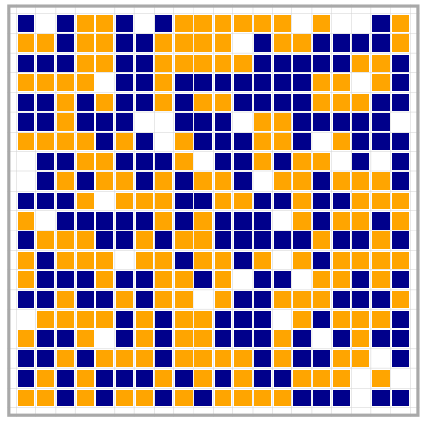

# `gridabm`: A Tool for 2D Cellular Automata and Agent-Based Models

This library provides tools to create, analyze, and visualize 2D cellular automata and agent-based models.
It is intended to be a learning resource for people interested in modeling complex dynamic phenomena.
Doing stuff gives you a more visceral sense of the content, this library gives you the tools to explore and interact with the models that you learn about.
For a quick introduction, check out [this article](https://socialdynamicshub.github.io/gridabm/).

## Installation

You can install `gridabm` from Github with the `remotes` library:

```
# install.packages("remotes")
remotes::install_github("socialdynamicshub/gridabm")
```

## Basic Usage

With the `gridabm` library, you can create and visualize automata in a few lines of code.

```
schelling_board <- create_board(
    n_states = 3,
    state_dist = c(0.1, 0.45, 0.45),
    axis_size = 20
)
schelling_results <- run_automaton(
  schelling_board,
  steps = 100,
  stepfunc = schelling_step,
  tolerance = 3
)
animate_model_run(
  schelling_results,
  marker_size = 7,
  color_scheme = theme_schelling()
)
```




## How to Contribute

This library is supposed remain lean.
However, you can contribute new update rules.
Check out the ones already implemented (e.g., look at the `schelling.R` script) and write your update rules in the same way.

Another way to contribute is to improve the documentation by writing better descriptions and adding examples.
